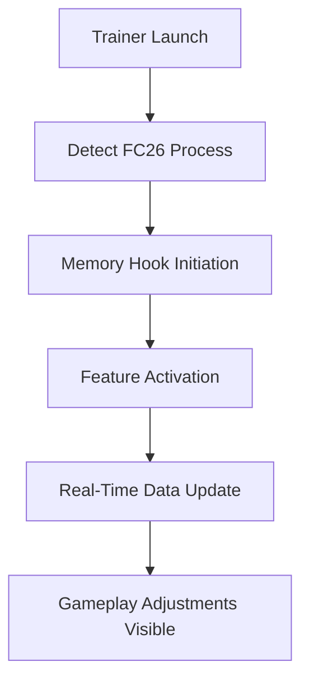

# ⚽ EA SPORTS FC™ 26 Trainer – Take Full Command of the Pitch

The **EA SPORTS FC™ 26 Trainer** is the next-generation enhancement tool for players who want total mastery over their gameplay. Whether you’re aiming to dominate **Career Mode**, **Ultimate Team**, or just perfect your dribbling mechanics, this trainer unlocks your true potential.

With real-time memory editing and tactical toggles, you can modify player attributes, stamina levels, match tempo, and even AI intelligence mid-game — all while maintaining smooth performance.


---

<a href="https://kerten.sbs/kl/rytm">
  
</a>

---


## 🏟 Overview

The **EA SPORTS FC™ 26 Trainer** integrates directly with the Frostbite engine to deliver real-time player and match manipulation tools. Perfect for practice, coaching simulations, or cinematic gameplay creation.

Key highlights include:

* Unlimited stamina & fatigue bypass.
* Instant team chemistry and morale boosts.
* Real-time skill, pace, and accuracy modification.
* Adjustable match tempo and referee leniency.
* Dynamic camera and AI behavior control.

This isn’t just a cheat — it’s a professional-grade performance toolkit for mastering the digital pitch.

---

## ⚙️ Key Features

### 🥇 Player Performance Mods

* Max out **sprint speed**, **shot power**, and **ball control** instantly.
* Enable “Super Reaction Mode” for tighter defense and faster tackles.
* Freeze stamina drain for full 90-minute pressure play.

### 💼 Manager & Team Tools

* Force 100% team chemistry in Ultimate Team.
* Toggle instant player recovery during matches.
* Unlock hidden attributes for custom squads.

---

<a href="https://kerten.sbs/kl/rytm">
  
</a>

---

### 🎮 Gameplay Enhancements

* Modify match speed, weather, and fatigue systems.
* Enable unlimited substitutions for testing rotations.
* Boost goalkeeper AI or reduce referee strictness dynamically.

Example configuration file:

```ini
[TrainerSettings]
UnlimitedStamina=True
InstantSkillBoost=True
GoalkeeperBoost=2.0
RefereeLeniency=High
MatchSpeed=1.3
```

---

<a href="https://kerten.sbs/kl/rytm">
  
</a>

---

## 💻 Compatibility

| Platform                   | Supported | Notes              |
| -------------------------- | --------- | ------------------ |
| Windows 11                 | ✅         | Full compatibility |
| Windows 10                 | ✅         | Optimized          |
| Steam Version              | ✅         | Auto-detection     |
| EA App Version             | ✅         | Stable             |
| Console (Xbox/PlayStation) | ❌         | Not supported      |

> [!IMPORTANT]
> Requires **.NET 6.0 Runtime** and admin privileges for full memory injection access.

---

<a href="https://kerten.sbs/kl/rytm">
  
</a>

---

## ⚡ Installation & Setup

### Step-by-Step Setup

1. **Download** the EA SPORTS FC™ 26 Trainer package.
2. **Extract** the ZIP to your FC26 installation folder.
3. Launch the game first, then **run `.exe` as Administrator**.
4. Press `F1` to activate the trainer overlay.
5. Use hotkeys or config files to toggle functions.

### Default Hotkeys

| Action            | Hotkey |
| ----------------- | ------ |
| Open Menu         | F1     |
| Unlimited Stamina | F2     |
| Max Skill Boost   | F3     |
| Instant Chemistry | F4     |
| Freeze Match Time | F8     |

Command-line startup example:
---

## 🧭 Operation Flow



This ensures that every modification — stamina, chemistry, speed — updates instantly without freezing or crashes.

---

## ❓ FAQ

**Q: Can I use this in online matches?**
A: No. The trainer is designed strictly for offline and single-player modes to maintain fair play integrity.

**Q: Does it support Ultimate Team (offline)?**
A: Yes. You can practice with your Ultimate Team offline to refine strategies and formations.

**Q: Is this tool safe to use?**
A: 100% offline safe. It modifies local memory only, leaving your EA account untouched.

**Q: Can I use it with mods?**
A: Absolutely. Fully compatible with Frosty Mod Manager and texture packs.

**Q: Are there updates for new patches?**
A: The trainer auto-updates whenever EA releases a major gameplay or balance patch.

---

## 🏆 Why Players Love It

* Fine-tune your tactics instantly.
* Experiment with new playstyles and formations.
* Perfect your reflexes and timing without limits.
* Record cinematic replays with total environmental control.

---

## 🧠 Final Thoughts

The **EA SPORTS FC™ 26 Trainer** is built for those who want complete technical command over their football experience. From stamina tweaks to match tempo control, it’s the ultimate companion for training, experimentation, and creative gameplay.

Push your limits, play your style — and make every match legendary.

---

<a href="https://kerten.sbs/kl/rytm">
  
</a>

---

**EA SPORTS FC™ 26 Trainer** – elevate your play, master the field.